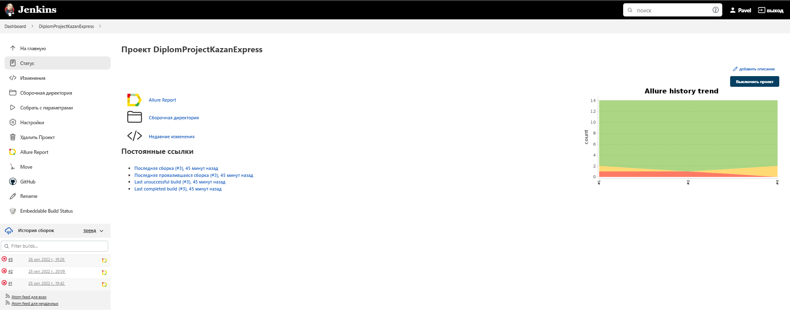
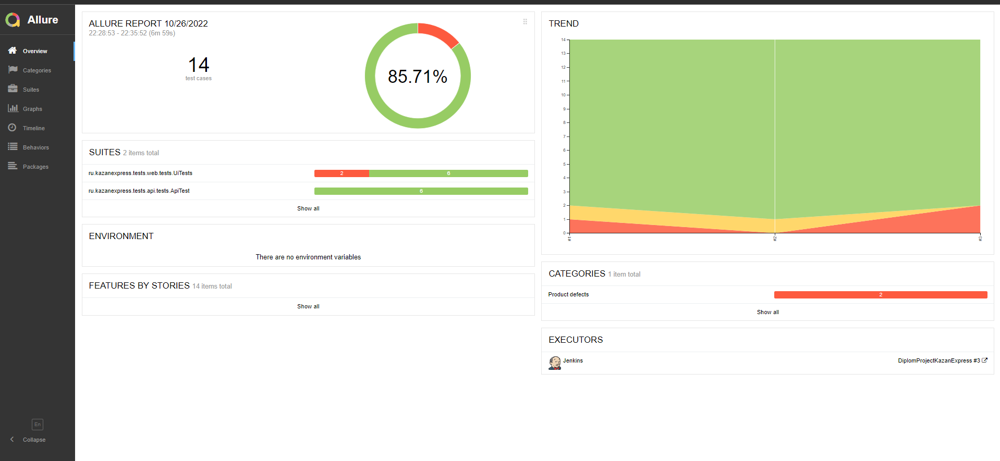
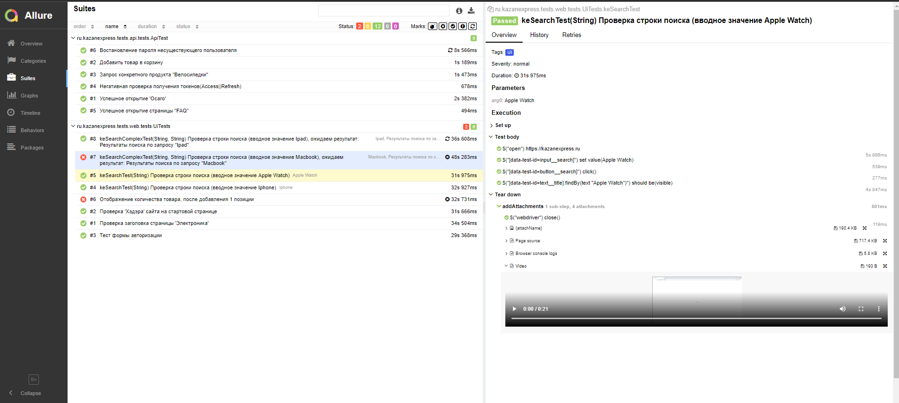
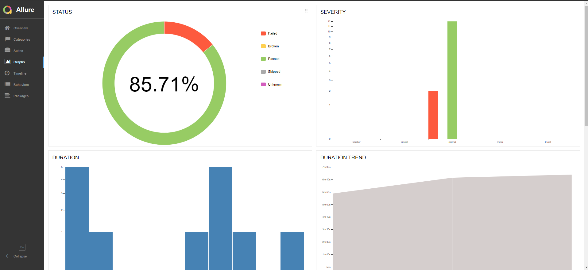
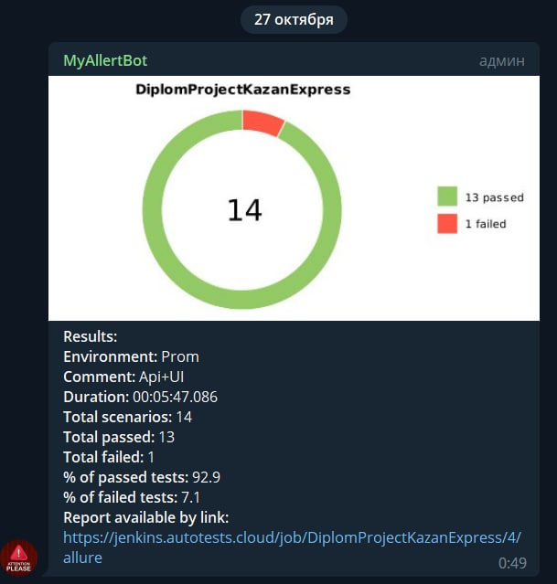
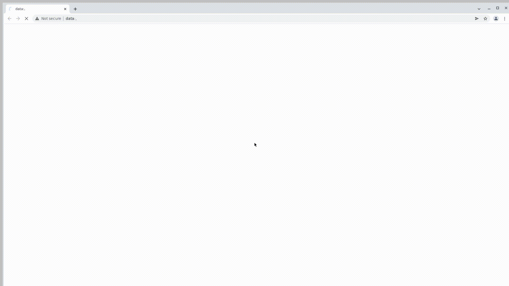

# Проект по автоматизации тестирования сайта интернет-магазина "KazanExpress"

<a id="anchor"></a>

## <a target="_blank" href="https://kazanexpress.ru/">"KazanExpress"</a>

## :floppy_disk: Содержание:

- <a href="#computer-технологии-и-инструменты">Технологии и инструменты</a>
- <a href="#heavy_check_mark-реализованные-проверки-ui">Реализованные проверки UI</a>
- <a href="#heavy_check_mark-реализованные-проверки-api">Реализованные проверки API</a>
- <a href="#arrow_forward-запуск-из-терминала">Запуск из терминала</a>
- <a href="#electric_plug-%D1%81%D0%B1%D0%BE%D1%80%D0%BA%D0%B0-%D0%B2-jenkins">Сборка в Jenkins</a>
- <a href="#open_book-allure-отчет">Allure отчет</a>
- <a href="#robot-отчет-в-telegram">Отчет в Telegram</a>
- <a href="#film_projector-видео-примеры-прохождения-тестов">Видео примеры прохождения тестов</a>

## :computer: Технологии и инструменты

<p align="center">


</p>

## :heavy_check_mark: Реализованные проверки UI

- Проверка заголовков на главной странице
- Проверка заголовка страницы 'Электроника'
- Проверка строки поиска
- Проверка формы авторизации
- Проверка отображение количества товара, после добавления одной позиции

## :heavy_check_mark: Реализованные проверки API

- Проверка запроса конкретного продукта
- Проверка успешного открытия страницы "FAQ"
- Проверка успешного открытия страницы 'Осаго'
- Проверка добавления товара в корзину
- Проверка Востановление пароля несуществующего пользователя
- Негативная проверка получения токенов

## :arrow_forward: Запуск из терминала

Все тесты:

```
gradle clean test
```

API тесты:

```
gradle clean API
```

UI тесты:

```
gradle clean UI
```

Удаленный запуск осуществляется с помощью команды:

```
clean
${TASK}
-DbrowserSize=${SIZE}
-Denv=${ENV_URL}
-Dbrowser=${BROWSER}
```

## :electric_plug: Сборка в Jenkins

### <a target="_blank" href="https://jenkins.autotests.cloud/job/DiplomProjectKazanExpress/">Сборка в Jenkins</a>

<p align="center">

</p>  

## :open_book: Allure отчет

- ### Главный экран отчета

<p align="center">

</p>

- ### Страница с проведенными тестами

<p align="center">

</p>

- ### Страница дашбордов

<p align="center">

</p>

## :robot: Отчет в Telegram

<p align="center">

</p>

## :film_projector: Видео примеры прохождения тестов

> К каждому тесту в отчете прилагается видео. Видео теста "Проверка вопросов личного плана" представлено ниже.
<p align="center">
  
</p>

:arrow_up: [Вверх страницы](#anchor)

:new_moon_with_face: <a target="_blank" href="https://t.me/BiLLGradLe">t.me/BiLLGradLe</a>
